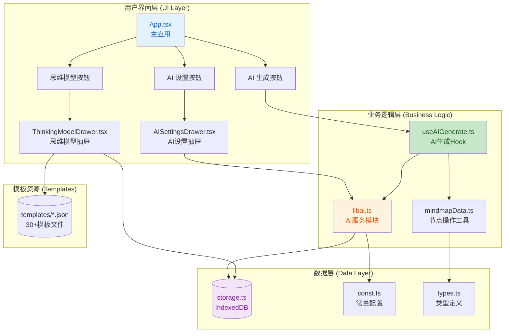
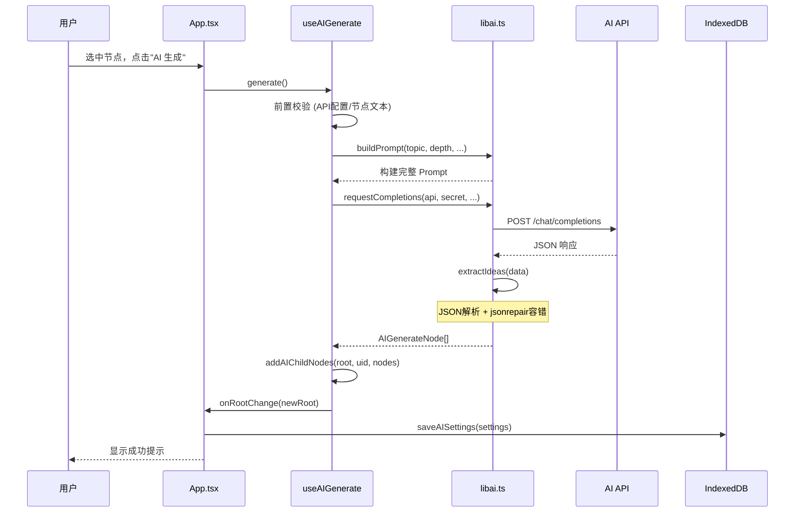

## 1. 高层级摘要 (TL;DR)

*   **影响范围:** **高** - 这是一个完整的功能模块迁移，将 Vue 3 项目中的 AI 生成思维导图功能完整迁移至当前 React 项目。
*   **核心变更:**
    *   ✨ 新增 **AI 生成思维导图** 核心功能，支持多种思维模型（第一性原理、批判性思维、贝叶斯思维等）
    *   🔧 新增 **AI 设置抽屉** 组件，支持 API 配置、模型选择、提示词管理
    *   📦 新增 **思维模型选择** 抽屉组件，提供 8 种预定义思维模型及示例模板
    *   💾 扩展 **IndexedDB 存储**，新增 AI 设置持久化
    *   📝 新增 **30+ 模板文件**，覆盖各类思维模型示例

---

## 2. 可视化概览 (代码与逻辑映射)

### 2.1 AI 生成思维导图架构图



### 2.2 AI 生成流程时序图



---

## 3. 详细变更分析

### 3.1 📦 依赖变更

| 包名 | 版本 | 用途 |
|------|------|------|
| `@ant-design/icons` | ^6.2.2 | UI 图标库 |
| `antd` | ^6.3.7 | UI 组件库 (Drawer, Tabs, Input, Select, Slider, Button, Upload, Radio, message) |
| `jsonrepair` | ^3.14.0 | AI 返回 JSON 自动修复容错 |

---

### 3.2 🆕 新增核心模块

#### 3.2.1 AI 服务模块 (`src/libai.ts`)

**核心功能:**

| 函数名 | 功能描述 |
|--------|----------|
| `buildPrompt()` | 构建 AI Prompt，拼接 6 大模块：Context → Role → Thinking Model → Examples → Rules → Task |
| `extractIdeas()` | 解析 AI 响应，支持多路径提取 + Markdown 清理 + jsonrepair 容错 |
| `requestCompletions()` | 发起 AI API 请求，兼容 OpenAI 标准格式与国产模型格式 |
| `checkModelConfig()` | 验证 API 配置有效性 |
| `expandPrompt()` | AI 提示词扩写优化 |
| `normalizeSecret()` | 密钥处理，支持 `my-` 前缀 Base64 解码 |

**关键代码片段 (Prompt 构建逻辑):**

```typescript
export function buildPrompt(
    topic: string,
    count: number,
    nextSystemPrompt: string,
    systemPrompt: string,
    settings: Partial<AISettings> = {},
): string {
    // 1. Context & Data (可选)
    // 2. Role Definition
    // 3. Thinking Model (可选)
    // 4. Output Examples
    // 5. Rules (节点数约束、字段长度约束、颜色约束)
    // 6. Task
}
```

---

#### 3.2.2 AI 生成 Hook (`src/useAIGenerate.ts`)

**职责:** 封装 AI 生成的完整流程

```typescript
export function useAIGenerate({
  settings,
  currentRoot,
  selectedUid,
  onRootChange,
}) {
  const [isGenerating, setIsGenerating] = useState(false)

  const generate = useCallback(async () => {
    // 1. 前置校验
    // 2. 获取节点文本和 nextSystemPrompt
    // 3. 构建 Prompt
    // 4. 请求 AI
    // 5. 解析响应
    // 6. 插入子节点
  }, [settings, currentRoot, selectedUid, onRootChange])

  return { isGenerating, generate }
}
```

---

#### 3.2.3 常量配置 (`src/const.ts`)

**思维模型列表 (8 种):**

| 模型名称 | Value | 描述 |
|----------|-------|------|
| 任意 | `default` | 通用总结方法 |
| 读书笔记 | `note-taking` | 按章节提取关键信息 |
| 课程学习 | `course-learning` | 提取知识点，生成代表性题目 |
| 第一性原理 | `first-principles` | 从基本事实推论创造新价值 |
| 费曼学习法 | `fermats-law` | 分解概念用简单语言解释 |
| 贝叶斯思维 | `bayesian-thinking` | 基于概率统计的推理方法 |
| 批判性思维 | `critical-thinking` | 系统客观分析信息 |
| 代码生成 | `code-generation` | 生成代码实现方案 |

**支持的 AI 模型:**
- GPT-4o / GPT-4o Mini / GPT-4 Turbo / GPT-3.5 Turbo
- Claude 3.5 Sonnet
- DeepSeek Chat
- GLM-4
- Qwen-Max
- Doubao-1-8

---

### 3.3 🎨 UI 组件变更

#### 3.3.1 AI 设置抽屉 (`src/AISettingsDrawer.tsx`)

**功能模块:**

| Tab | 配置项 |
|-----|--------|
| **基础设置** | API 地址、密钥、模型选择、生成节点数 (1-20)、温度 (0-2)、语言、思维模型 |
| **知识库** | 系统提示词文本域、文件上传、AI 扩写按钮 |

**特色功能:**
- ✅ **配置验证**: 实时检测 API 配置有效性，显示成功/失败状态
- ✅ **提示词扩写**: 调用 AI 优化和扩写系统提示词
- ✅ **文件上传**: 支持 `.md` / `.txt` 文件自动填充

---

#### 3.3.2 思维模型抽屉 (`src/ThinkingModelDrawer.tsx`)

**交互流程:**
1. Radio 单选思维模型
2. 展示模型描述和原理
3. 提供示例模板按钮
4. 点击模板按钮 → 加载 JSON 模板 → 插入选中节点

---

### 3.4 📊 数据结构变更

#### 3.4.1 节点数据扩展 (`src/types.ts`)

```typescript
export interface MindNodeData {
  uid?: string
  expand?: boolean
  tag?: MindNodeTag[]
  // 新增字段 ↓
  note?: string              // 详细描述
  nextSystemPrompt?: string  // 递进生成提示
  color?: string             // 节点颜色
}

// 新增类型 ↓
export interface AISettings {
  api: string
  secret: string
  model: string
  depth: number
  temperature: number
  thinkingModel: string
  systemPrompt: string
  language: string
}

export interface AIGenerateNode {
  data: {
    text: string
    note: string
    nextSystemPrompt: string
    color: string
  }
  children: AIGenerateNode[]
}
```

---

### 3.5 💾 存储层变更 (`src/storage.ts`)

**IndexedDB 升级:**
- DB_VERSION: `1` → `2`
- 新增 Object Store: `ai-settings`

| 函数 | 功能 |
|------|------|
| `loadAISettings()` | 加载 AI 设置 |
| `saveAISettings()` | 保存 AI 设置 |

---

### 3.6 🛠️ 工具函数变更 (`src/mindmapData.ts`)

**新增函数:**

| 函数名 | 功能 |
|--------|------|
| `getNodeText()` | 获取节点文本 |
| `getNodeSystemPrompt()` | 获取节点递进提示 |
| `addAIChildNodes()` | 批量添加 AI 生成的子节点 |
| `aiNodeToMindNode()` | AI 节点格式转换 |

---

### 3.7 📄 模板文件

**新增 30+ JSON 模板文件:**

| 模板类型 | 文件数量 | 示例 |
|----------|----------|------|
| default | 5 | 高效学习方法、深度学习总结、机器学习经典算法 |
| note-taking | 4 | 《麦肯锡高效工作法》、《终身成长》、《关键跨越》、《冰鉴》 |
| course-learning | 12 | 小学数学一年级~六年级上下册 |
| first-principles | 2 | 制造火箭的关键步骤、如何建造太空战舰 |
| fermats-law | 2 | 向八岁小朋友介绍量子、量子计算机工作原理 |
| bayesian-thinking | 2 | 世界历史人口变化、加密货币价值 |
| critical-thinking | 2 | 资本主义终局、凯恩斯主义影响 |
| code-generation | 2 | 简洁版浏览器开发、简洁版 Nginx 实现 |

---

### 3.8 📝 文档变更

| 文件 | 内容 |
|------|------|
| `docs/project/project.md` | 项目技术栈和结构说明 |
| `docs/task/aigenerate/AI生成思维导图的开发任务清单.md` | 详细迁移任务清单 (268 行) |
| `docs/task/aigenerate/CONTEXT.md` | 项目上下文和关键决策 |

---

## 4. 影响与风险评估

### 4.1 ⚠️ 潜在风险

| 风险项 | 风险等级 | 说明 |
|--------|----------|------|
| **IndexedDB 版本升级** | 中 | DB_VERSION 从 1 升至 2，已有用户首次访问时需处理迁移 |
| **API 密钥安全** | 中 | 密钥存储在 IndexedDB，需确保不在生产环境暴露 |
| **AI 响应格式兼容性** | 低 | 已实现多路径提取 + jsonrepair 容错，但极端情况可能失败 |
| **模板文件体积** | 低 | 30+ JSON 模板可能增加打包体积 |

### 4.2 ✅ 测试建议

1.  **功能测试:**
    - [ ] AI 生成完整流程：选中节点 → 生成 → 插入子节点
    - [ ] 递进生成：在 AI 生成的子节点上再次生成
    - [ ] 思维模型切换后生成结果差异
    - [ ] 系统提示词对生成结果的影响

2.  **异常测试:**
    - [ ] API 未配置时的错误提示
    - [ ] 节点文本为空时的错误提示
    - [ ] API 请求失败时的错误处理
    - [ ] JSON 解析失败时的容错修复

3.  **兼容性测试:**
    - [ ] 不同 AI 模型的响应格式兼容性 (GPT-4o / Claude / DeepSeek / GLM-4 / Qwen)
    - [ ] 不同语言的输出控制 (中文 / English)

4.  **存储测试:**
    - [ ] AI 设置持久化：刷新页面后设置保留
    - [ ] IndexedDB 版本迁移：从 v1 升级到 v2

---

## 5. 关键技术亮点

1.  **🔧 Prompt 工程:** 6 模块结构化 Prompt，支持思维模型注入、递进生成、节点约束
2.  **🛡️ 容错机制:** jsonrepair 自动修复 AI 返回的非标准 JSON
3.  **🎯 递进生成:** `nextSystemPrompt` 字段实现逐层深入、方向可控的无限展开
4.  **🎨 颜色心理学:** 自动为节点分配符合"颜色心理学"的 Hex 颜色码
5.  **📦 模板系统:** 30+ 预定义模板，覆盖学习、分析、代码生成等场景