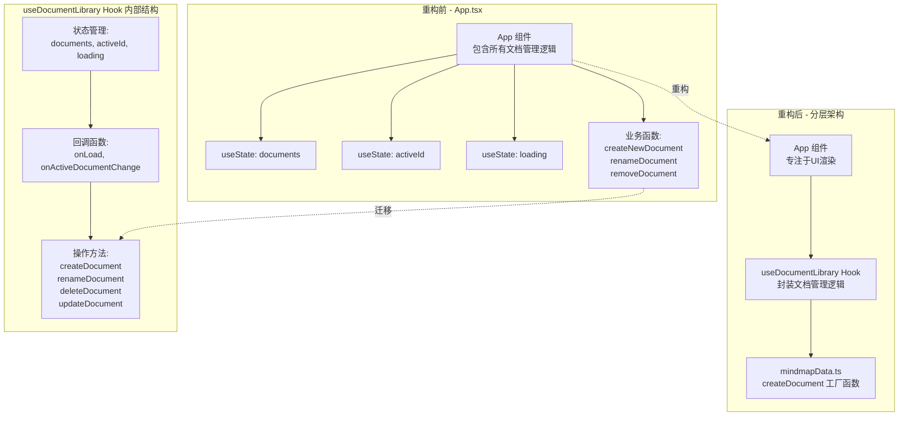
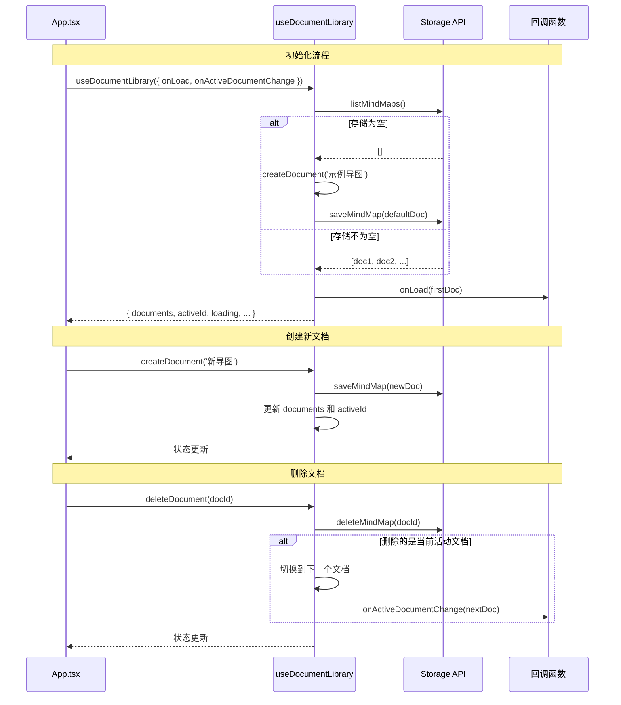

## 1. 高层摘要 (TL;DR)

*   **影响范围:** **中等** - 重构核心文档管理逻辑，将其从 `App.tsx` 提取到独立的自定义 Hook
*   **关键变更:**
    *   ✨ 新增 **`useDocumentLibrary`** 自定义 Hook，封装文档库的状态管理和业务逻辑
    *   🧪 为新 Hook 添加完整的单元测试（8个测试用例）
    *   📦 将 `createDocument` 函数从 `App.tsx` 迁移到 `mindmapData.ts`
    *   🔧 添加 `@vitest/ui` 开发依赖，增强测试体验
    *   🗑️ 更新 `.gitignore`，忽略 `.specstory` 目录

## 2. 可视化概览 (代码与逻辑映射)

### 架构重构流程图



### 文档生命周期管理流程



## 3. 详细变更分析

### 📦 新增自定义 Hook: `useDocumentLibrary`

**文件:** `src/hooks/useDocumentLibrary.ts` (新增)

**变更说明:**
将文档库管理逻辑从 `App.tsx` 提取到独立的自定义 Hook，实现关注点分离。

**核心功能:**

| 功能模块 | 方法名 | 说明 |
|---------|--------|------|
| 状态管理 | `documents` | 文档列表状态 |
| | `activeId` | 当前活动文档ID |
| | `loading` | 加载状态标识 |
| 文档操作 | `createDocument(title)` | 创建新文档并保存 |
| | `renameDocument(id, title)` | 重命名文档 |
| | `deleteDocument(id)` | 删除文档 |
| | `updateDocument(doc)` | 更新文档（按更新时间排序） |
| 回调钩子 | `onLoad(firstDoc)` | 首次加载完成回调 |
| | `onActiveDocumentChange(doc)` | 活动文档切换回调 |

**技术亮点:**
- 使用 `useRef` 存储回调函数，避免闭包陷阱
- 使用 `useRef` 存储 `documents` 最新值，优化 `renameDocument` 性能
- 自动处理空存储情况，创建默认示例文档

---

### 🧪 测试覆盖: `useDocumentLibrary.test.ts`

**文件:** `src/hooks/useDocumentLibrary.test.ts` (新增)

**测试用例清单:**

| 测试场景 | 验证点 |
|---------|--------|
| 初始加载 | ✅ `loading` 状态正确切换<br/>✅ 自动加载存储文档<br/>✅ 正确设置 `activeId` |
| 空存储处理 | ✅ 创建默认"示例导图"<br/>✅ 自动保存到存储 |
| 回调触发 | ✅ `onLoad` 正确调用并传递首个文档 |
| 创建文档 | ✅ 新文档插入列表头部<br/>✅ 自动设为活动文档<br/>✅ 调用 `saveMindMap` |
| 重命名文档 | ✅ 标题更新<br/>✅ `updatedAt` 时间戳更新<br/>✅ 持久化保存 |
| 删除非活动文档 | ✅ 从列表移除<br/>✅ `activeId` 不变 |
| 删除活动文档 | ✅ 自动切换到下一文档<br/>✅ 触发 `onActiveDocumentChange` 回调 |

---

### 🔧 App.tsx 重构

**文件:** `src/App.tsx`

**主要变更:**

#### 1. 移除的状态和逻辑
```typescript
// ❌ 移除
const [documents, setDocuments] = useState<MindMapDocument[]>([])
const [activeId, setActiveId] = useState<string | null>(null)
const [loading, setLoading] = useState(true)

// ❌ 移除函数
function createDocument(...) { ... }
async function load() { ... }
```

#### 2. 引入 Hook
```typescript
// ✅ 新增
const {
  documents,
  activeId,
  loading,
  setActiveId,
  createDocument,
  renameDocument,
  deleteDocument,
  updateDocument,
} = useDocumentLibrary({
  onLoad,
  onActiveDocumentChange,
})
```

#### 3. 简化事件处理
| 原函数名 | 新函数名 | 变更说明 |
|---------|---------|---------|
| `createNewDocument()` | `handleCreateDocument()` | 调用 Hook 的 `createDocument()` |
| `renameDocument(doc)` | `handleRenameDocument(doc)` | 调用 Hook 的 `renameDocument(id, title)` |
| `removeDocument(doc)` | `handleDeleteDocument(doc)` | 调用 Hook 的 `deleteDocument(id)` |

#### 4. 新增回调函数
```typescript
const onLoad = useCallback((firstDoc: MindMapDocument) => {
  setCurrentRoot(cloneRoot(firstDoc.root))
  setCurrentLayout(firstDoc.layout)
}, [])

const onActiveDocumentChange = useCallback((doc: MindMapDocument | null) => {
  if (!doc) return
  setCurrentRoot(cloneRoot(doc.root))
  setCurrentLayout(doc.layout)
  setSelectedUid(null)
  setDirty(false)
}, [])
```

---

### 📝 工具函数迁移

**文件:** `src/mindmapData.ts`

**新增函数:**

```typescript
export function createDocument(
  title = '未命名导图',
  root = createBlankRoot(title),
): MindMapDocument {
  const now = Date.now()
  return {
    id: createId(),
    title,
    root,
    layout: 'mindMap',
    createdAt: now,
    updatedAt: now,
  }
}
```

**说明:** 将文档工厂函数从 `App.tsx` 迁移到 `mindmapData.ts`，与思维导图数据结构相关的函数集中管理。

---

### 📦 依赖更新

**文件:** `package.json`

| 包名 | 版本 | 类型 | 说明 |
|------|------|------|------|
| `@vitest/ui` | `^4.1.6` | devDependencies | Vitest 可视化测试界面 |

---

### ⚙️ 配置更新

**文件:** `vite.config.ts`

```typescript
/// <reference types="vitest/config" />
```

**说明:** 添加 Vitest 类型引用，支持 TypeScript 类型检查。

---

### 🗑️ Git 忽略规则

**文件:** `.gitignore`

```
+ .specstory
```

**说明:** 忽略 `.specstory` 目录（可能是规范或测试辅助工具生成的目录）。

---

### 🧹 代码清理

**文件:** `src/mindmapData.test.ts`

移除未使用的导入：
```typescript
- import type { MindNode } from './types'
```

## 4. 影响与风险评估

### ✅ 正面影响

1. **代码可维护性提升** 📈
   - 文档管理逻辑与 UI 渲染分离
   - `App.tsx` 代码行数减少约 50 行
   - Hook 可独立测试和复用

2. **测试覆盖率提升** 🧪
   - 新增 8 个单元测试用例
   - 覆盖文档生命周期的主要场景

3. **状态管理更清晰** 🎯
   - 文档状态集中在 Hook 内部管理
   - 通过回调机制与父组件通信

### ⚠️ 潜在风险

| 风险点 | 影响 | 缓解措施 |
|--------|------|----------|
| **回调闭包问题** | 可能导致回调函数中使用过期的状态 | ✅ 已使用 `useRef` 存储回调函数 |
| **异步竞态条件** | 快速操作可能导致状态不一致 | ⚠️ 建议添加操作锁或防抖 |
| **错误处理缺失** | `listMindMaps()` 等异步操作失败时静默处理 | ⚠️ 建议添加错误提示机制 |

### 🧪 测试建议

**建议测试场景:**

1. **文档切换场景**
   - 在有未保存更改时切换文档，验证 `confirmDiscard()` 逻辑
   - 快速连续创建/删除文档，验证状态一致性

2. **边界情况**
   - 删除最后一个文档，验证是否创建默认文档
   - 重命名为空字符串或超长字符串
   - 并发创建多个文档

3. **持久化验证**
   - 刷新页面后验证文档列表是否正确恢复
   - 验证 `activeId` 是否正确保存和恢复

4. **性能测试**
   - 创建大量文档（如 100+）后验证列表渲染性能
   - 验证 `updateDocument` 排序逻辑的性能

### 🔍 代码审查建议

1. **错误处理增强**
   ```typescript
   // 建议在 useDocumentLibrary.ts 中添加错误处理
   .catch((error) => {
     console.error('Failed to load documents:', error)
     // 可考虑添加用户提示
   })
   ```

2. **类型安全**
   - `documentsRef.current.find()` 可能返回 `undefined`，建议添加空值检查

3. **回调命名规范**
   - 建议统一回调命名：`onLoad` vs `onActiveDocumentChange`（前者无 `on` 前缀不一致）